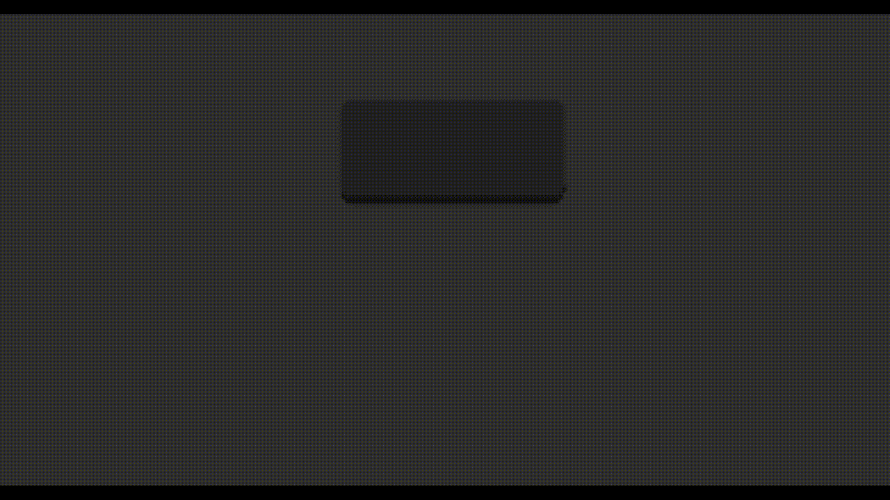

# Carousel

Do you have a rotary encoder that isn't pulling it's weight?
Do you have some obscure characters on a layer that you never use and can't remember?
Then this is the module for you!


## What does it do?
It allows you to define a list of alternate unicode characters for any keycode. Then when you type that keycode you can use the custom CSL_L and CSL_R keycodes to replace it with the next (or previous) alternate in the list.

The main benefit of the carousel is that you don't have to remember where things are, you just remember the letter it starts with and scroll on through until you find what you're looking for.

For example, let's say you often need to type è, é, ê, ë, and à, á, â, ã, ä, and å. Rather than stuffing that all into another layer or two (or worse, chords) you could define a carousel for KC_E and a carousel for KC_A and access any alternate you need with just CSL_L and CSL_R.

## Ok, how do I try it?
Carousel is implemented as a QMK community mod. As you might expect there is a [community modules section in the qmk docs](https://docs.qmk.fm/features/community_modules) and of course there is a lovely [getreuer article about community modules](https://getreuer.info/posts/keyboards/qmk-community-modules/index.html) as well that explain how to get these working.

## It's installed, now what?
**First** if you're going to use unicode you will need to [specify your unicode input mode](https://docs.qmk.fm/features/unicode#input-modes). Add the following to your config.h
```c
#define UNICODE_SELECTED_MODES UNICODE_MODE_LINUX
// or
#define UNICODE_SELECTED_MODES UNICODE_MODE_MACOS
// or
#define UNICODE_SELECTED_MODES UNICODE_MODE_WINCOMPOSE
```

**Second** you need to add the CSL_R and CSL_L keycodes to your keymap somewhere. I bound them to clockwise and counterclockwise on my rotary encoder. *Keep in mind you must go slowly when scrolling through.*
```c
const uint16_t PROGMEM encoder_map[][NUM_ENCODERS][NUM_DIRECTIONS] = {
    [BASE] = { ENCODER_CCW_CW(CSL_L, CSL_R) },
};
```
**Finally** you need to define some carousels!
Somewhere in your keymap.c add
```c
const Carousel PROGMEM carousels[CAROUSEL_MAX] = {
    {KC_E,"eèéêë"},
    {KC_A,"aàáâãäå"},
    {KC_DOT,".😁😬😘😭🤬"}
}; 
```
Each carousel starts with the keycode that "triggers" the carousel and is followed by the list of characters to scroll through. Carousels can have as many or as few alternate characters as you like.

You can have up to 20 carousels.
## But what if I want more?
You can increase the limit by adding the following to your keymap.c.
```c
#define CAROUSEL_MAX 21
```
## Hey, it doesn't work!
If it's missing some alternates or is printing random unicode characters some of the time you likely need to slow down. The way unicode is handled is by sending a series of keystrokes that the OS recognizes and then replaces with the appropriate unicode character. If you go too fast you can interrupt this process and get all sorts of bizarre behavior.

If it's putting a wierd box instead of certain alternates it's likely the case that the app you're using does not support that character. Try inputting into something more robust, like a browser.